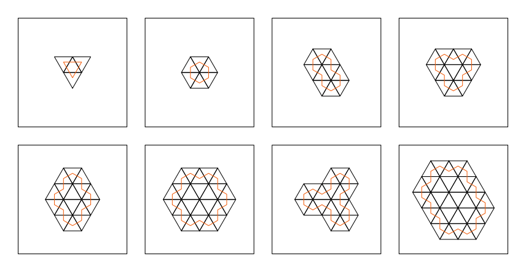
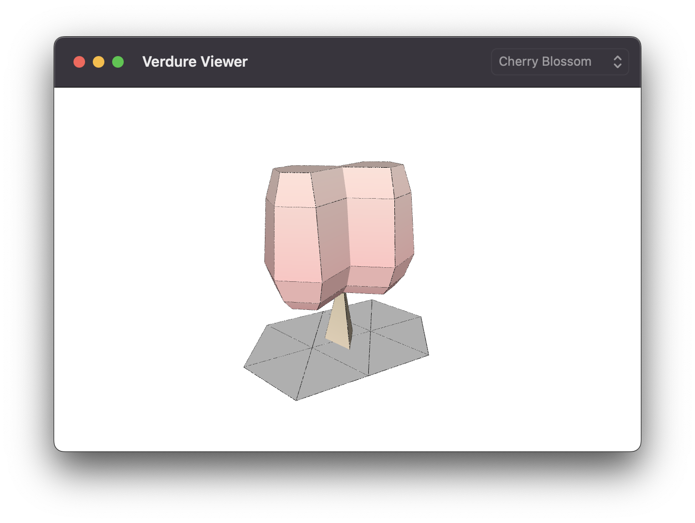

# Introduction
Verdure is a Swift package written to facilitate the generation of foliage meshes to model real-world trees in a simplistic but stylised fashion. Primarily built for use within [Harvest](https://github.com/zilmarinen/Harvest) and [Orchard](https://github.com/zilmarinen/Orchard), Verdure generates a stylised, low poly set of foliage meshes that can be used as a tileset for foliage decoration.

## About
Verdure was built as a prototyping tool to allow for rapid development and visual feedback of foliage meshes that are generated programmatically. By pre-generating foliage variations we can reduce the amount of time and effort required to create a complete set by hand. An example `Verdure Viewer` application is included to facilitate the visualisation of each foliage mesh configuration to validate the generated mesh output.

## Inspiration
Inspired by [Dual Graph](https://en.wikipedia.org/wiki/Dual_graph#Variations) [Tile Cutting](https://twitter.com/OskSta/status/1448248658865049605), the aim of this project is to generate low poly representations of various tree species without the use of any third party modelling tools. Also of worthy note (but not used within this project) are [L-Systems](https://en.wikipedia.org/wiki/L-system).

# Trunk & Canopy Areas
Building upon a triangular grid we can predefine a custom set of `Area` configurations that encode the triangles that form the footprint for each foliage type. These areas define the total space that the canopy occupies and thus the footprint for each foliage type. From these configurations a dual area can be calculated by iterating through the outer edges of the footprint to create a shape which is contained entirely within the areas perimeter. This inner area can then also be inset itself to create contours which when layered result in volumetric 3D shapes.

# Meshes
The geometry for each tree is generated from a predefined area for both the trunk and canopy which are then extruded to create a 3D `Mesh`. Each type of foliage has preset properties to determine the height, profile and radius for the canopy as well as the area, radius and height of the trunk. These two meshes are then combined into a single instance representing the finished foliage mesh.

## Dependencies
[Euclid](https://github.com/nicklockwood/Euclid) is a Swift library for creating and manipulating 3D geometry and is used extensively within this project for mesh generation and vector operations.

[PeakOperation](https://github.com/3Squared/PeakOperation) is a Swift microframework providing enhancement and conveniences to [`Operation`](https://developer.apple.com/documentation/foundation/operation). 

